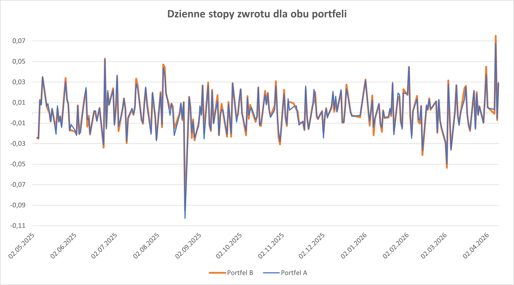

Projekt dotyczy analizy ryzyka rynkowego dwóch portfeli inwestycyjnych składających się z akcji pięciu największych banków
(PKO BP, Pekao, Santander, mBank, Alior) z ostatnich 250 dni roboczych.

Głównym celem było obliczenie i porównanie Wartości Zagrożonej (**Value at Risk - VaR**) dwiema metodami: **historyczną** oraz **parametryczną**.

**Kluczowe analizy**
- przygotowanie i czyszczenie danych
- zdefinowanie dwóch portfeli akcji: **portfel A: równe wagi; portfel B: losowe wagi**
- obliczenie **logarytmicznych stóp zwrotu** dla obu portfeli
- obliczenie VaRu historycznego i parametrycznego

**Wnioski**
- większe ryzyko dla portfela B
- bardziej pesymistyczne wyniki dla VaRu parametrycznego niż historycznego
- duży spadek w dziennych stopach zwrotu dnia 22.08.2025 dla wszystkich banków

Otrzymany wykres dziennych stóp zwrotu dla obu portfeli:

